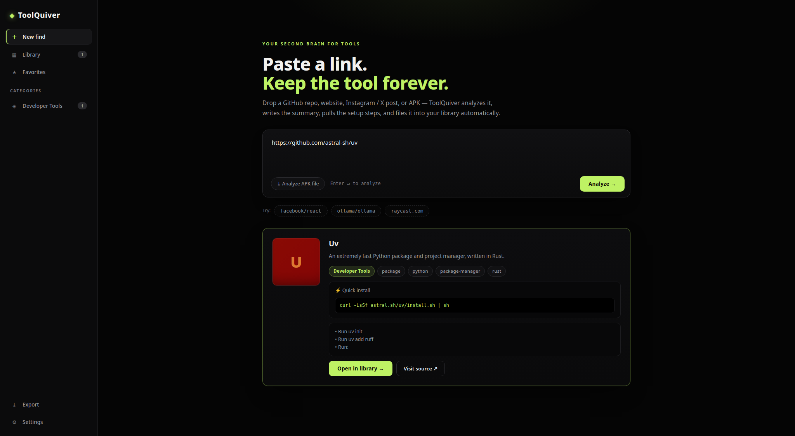

<div align="center">

# ◈ ToolQuiver

**Paste any link. Keep the tool forever.**

Your second brain for tools — drop a GitHub repo, website, Instagram/X post, or APK,
and ToolQuiver analyzes it into a beautifully categorized personal library.

[](https://github.com/CYPHERLYNX/toolquiver/releases)
[](https://www.electronjs.org/)
[](LICENSE)
[](https://github.com/CYPHERLYNX/toolquiver/actions)



[Download for Windows](https://github.com/CYPHERLYNX/toolquiver/releases) · [Features](#-features) · [How it works](#-how-it-works) · [Contributing](CONTRIBUTING.md)

</div>

---

## The problem

You see a cool tool in a reel. A repo linked in a tweet. An APK in a Telegram channel.
You bookmark it, screenshot it, tell yourself you'll check it later — and never do.
Your discoveries rot across five different apps.

## The fix

**ToolQuiver is a capture-first library for every tool you discover.** One input box,
like chatting with an LLM. Paste anything — ToolQuiver figures out what it is, writes
the summary, extracts the setup steps, files it under the right category, and keeps it
searchable forever. Your library lives on your machine. No account, no cloud, no API
key required. (Analysis fetches public metadata — repo info, page titles — directly
from the sites you link; nothing is sent to analytics or AI services.)

```
Paste:  https://github.com/astral-sh/uv
   ↓
◈ Uv — Developer Tools
  "An extremely fast Python package and project manager, written in Rust."
  ⚡ Quick install:  pip install uv
  Setup: steps extracted from the README
  ★ 90K stars · Rust · saved to your vault
```

## ✨ Features

- **🔗 Universal link analysis** — GitHub repos, any website, Instagram reels/posts, X posts, and `.apk` files (local or URL)
- **🧠 Smart auto-categorization** — 16 categories (AI/ML, DevTools, DevOps, Design, Productivity…) with confidence scores and tags. Zero API keys, runs fully offline
- **📦 Real APK parsing** — reads the binary `AndroidManifest.xml` and `resources.arsc` to extract package name, version, permissions, label, and the raster launcher icon when the APK ships one (vector-only adaptive icons are skipped rather than faked)
- **⚡ Setup in plain English** — pulls install commands and quick-start steps out of READMEs and simplifies them
- **🖼️ Auto covers** — repo social cards, Open Graph images, and APK icons saved locally
- **🔍 Library that thinks** — full-text search, category filters, favorites, personal notes, star counts
- **📤 Export** — your whole vault as Markdown or JSON, anytime
- **🔒 Local-first** — your library is a SQLite database on your machine. Analyzing a link fetches its public metadata (repo details, page title, preview image) directly from that site — no analytics, no AI APIs, no account, and your vault never leaves your PC

## 🖥️ How it works

| You paste… | ToolQuiver… |
|---|---|
| `github.com/owner/repo` | Fetches repo metadata + README via the GitHub API → name, description, stars, topics, cover image, setup steps |
| Any website URL | Reads Open Graph / meta tags → title, description, preview image |
| Instagram / X link | Tries public embeds, then pulls out any links mentioned — you pick which ones to analyze (these platforms block bots, so pasting the actual link is the reliable path) |
| `.apk` file or link | Parses the binary manifest → package, version, permissions, icon, label |
| Plain text / caption | Finds links inside it and analyzes those |

Categorization is a weighted heuristic engine (`src/analyzer/categorize.js`) scoring
name ×3, topics ×2.5, description ×2, and README ×0.5 — with word-boundary matching so
"AI" doesn't match "said". No LLM calls, no keys, instant.

## 🚀 Quick start

**Prerequisites:** [Node.js](https://nodejs.org/) 20+

```bash
git clone https://github.com/CYPHERLYNX/toolquiver.git
cd toolquiver
npm install
npm start
```

**Build the Windows installer:**

```bash
npm run dist
# → dist/ToolQuiver-Setup-1.0.0.exe
```

> **Rate limits:** GitHub allows 60 API requests/hour without a token. Paste a
> personal access token in *Settings* to raise it to 5,000/hr. Everything else
> works without any token.

## 🛠️ Tech stack

- **Electron 33** — Windows desktop shell
- **better-sqlite3** — local vault database
- **Zero frontend frameworks** — hand-rolled black-theme UI, no build step
- **Dependency-free analyzers** — the AXML + ARSC parsers are written from scratch
  (the only native module in the project is `better-sqlite3`)

```
toolquiver/
├── main.js                 # Electron main process + IPC
├── preload.js              # secure renderer bridge
├── renderer/               # black-theme UI (HTML/CSS/JS)
├── src/
│   ├── analyzer/           # the brain
│   │   ├── detect.js       # link-type detection
│   │   ├── github.js       # GitHub API analysis
│   │   ├── website.js      # Open Graph scraping
│   │   ├── social.js       # Instagram/X handling + entity extraction
│   │   ├── apk.js          # binary AndroidManifest.xml + resources.arsc parser
│   │   ├── categorize.js   # heuristic auto-categorization engine
│   │   └── setup.js        # README setup-step extraction
│   └── store/db.js         # SQLite library
└── test/analyzer.test.js   # 18 automated tests
```

See [docs/ARCHITECTURE.md](docs/ARCHITECTURE.md) for the full breakdown.

## 🗺️ Roadmap

- [ ] Browser extension — "Send to ToolQuiver" from any page
- [ ] YouTube / TikTok link analysis
- [ ] Duplicate detection across re-uploads
- [ ] Auto-update via electron-updater
- [ ] Optional local-LLM summaries (Ollama) for deeper analysis
- [ ] macOS / Linux builds

Vote with 👍 on [issues](https://github.com/CYPHERLYNX/toolquiver/issues) — or just open a PR.

## 🤝 Contributing

PRs welcome! `src/analyzer/` is pluggable — new source types are a great first
contribution. Read [CONTRIBUTING.md](CONTRIBUTING.md), run `npm test`, keep it
key-free and local-first.

## ⭐ Why star this?

If you've ever lost a tool to a forgotten bookmark, ToolQuiver is for you.
Star it, share your vault screenshots in
[Discussions](https://github.com/CYPHERLYNX/toolquiver/discussions) — and never
lose a discovery again.

## 📄 License

MIT — see [LICENSE](LICENSE). Built for the open-source community. ◈
